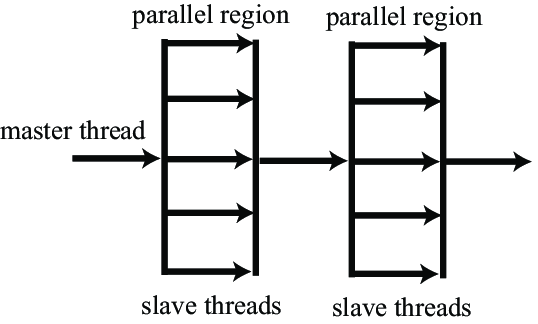

# ParallelProgramming
Tasks given to solve mathematical problems with parallelism

# Example of tasks
- Sum of 4 numbers
- Matrix Multiplication
- Sum of the first 100 numbers
- Travelling salesman
